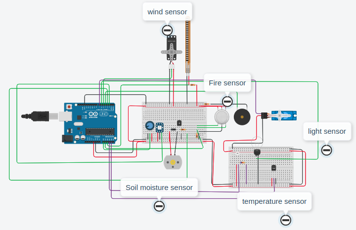

## Greenhouse control system

An simple arduino project built using tinkercad. Our project `Greenhouse control system`  controls all the basic operations in a greenhouse, thus minimize human intervention.

## Project Screen Shot(s)

## Tinkercad Link

https://www.tinkercad.com/things/fpzEqZgX6aa

## Reflection

  This Project was built as a part of Microprocessor and Computer Architecture Lab (UE19CS256) course